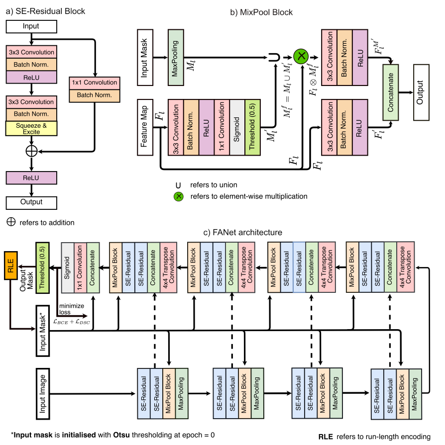
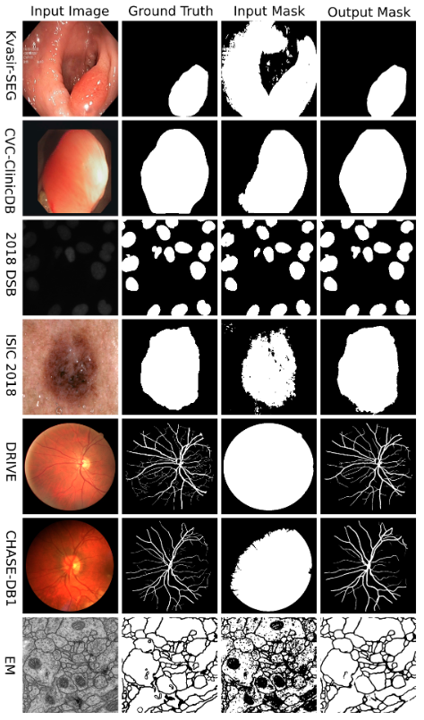

# FANet: A Feedback Attention Network for Improved Biomedical Image Segmentation
Authors: Nikhil Kumar Tomar, Debesh Jha, Michael A. Riegler, Håvard D. Johansen, Dag Johansen, Jens Rittscher, Pål Halvorsen and  Sharib Ali
 
Research paper: [https://arxiv.org/pdf/2103.17235.pdf](https://arxiv.org/pdf/2103.17235.pdf)

## Abstract

The increase of available large clinical and exper- imental datasets has contributed to a substantial amount of important contributions in the area of biomedical image anal- ysis. Image segmentation, which is crucial for any quantitative analysis, has especially attracted attention. Recent hardware advancement has led to the success of deep learning approaches. However, although deep learning models are being trained on large datasets, existing methods do not use the information from different learning epochs effectively. In this work, we leverage the information of each training epoch to prune the prediction maps of the subsequent epochs. We propose a novel architecture called feedback attention network (FANet) that unifies the previous epoch mask with the feature map of the current training epoch. The previous epoch mask is then used to provide a hard attention to the learned feature maps at different convolutional layers. The network also allows to rectify the predictions in an iterative fashion during the test time. We show that our proposed feedback attention model provides a substantial improvement on most segmentation metrics tested on seven publicly available biomedical imaging datasets demonstrating the effectiveness of FANet.

## Architecture

## Dataset:
- [Kvasir-SEG](https://datasets.simula.no/kvasir-seg)
- CVC-ClinicDB
- [DRIVE](https://drive.grand-challenge.org)
- [CHASE DB1](https://blogs.kingston.ac.uk/retinal/chasedb1)
- [2018 Data Science Bowl](https://www.kaggle.com/c/data-science-bowl-2018)
- [ISIC 2018](https://challenge2018.isic-archive.com/task1/)
- [EM](https://imagej.net/events/isbi-2012-segmentation-challenge)

## Qualitative results

## Contact
Please contact nikhilroxtomar@gmail.com and debesh@simula.no for any further questions. 
